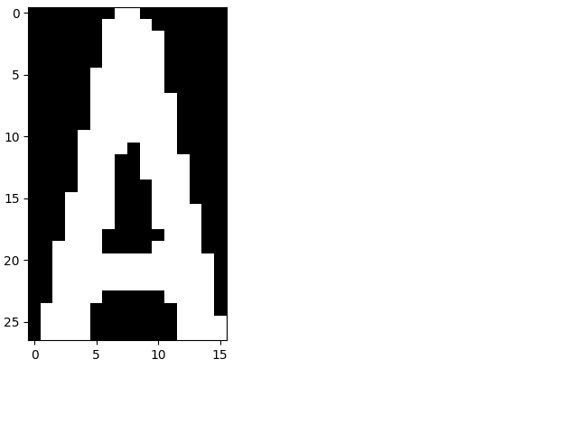
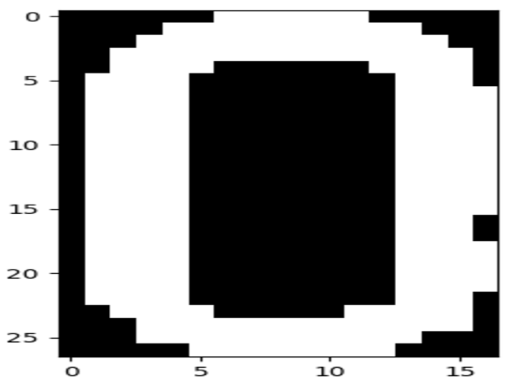
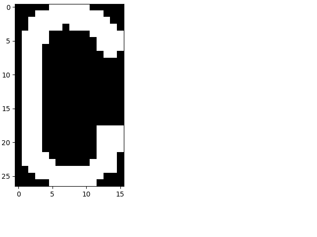
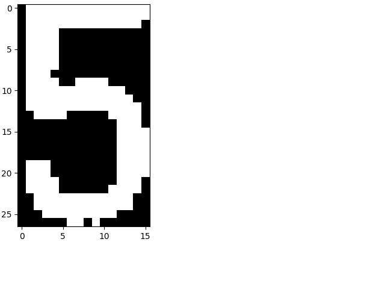
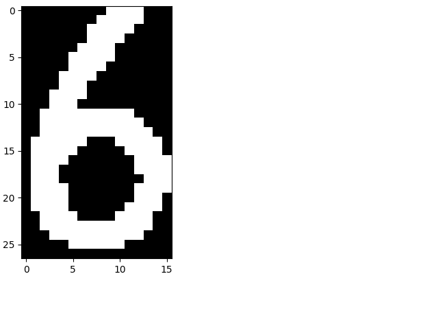

# Vehicle_Lincense_Plate_Recognition

> Data Distribution:

| components | number |
| :--------: | :----: |
| integers | 4679 |
| alphabets | 9796 |
| Chinese_letters | 3974 |
| percentage | training_set : testing_set == 4 : 1 |

> Usage:
1. To see the data_set accuracy: `python restore_lenet.py`, and change the parameters of the test_lst in main function.

2. To predict the plate of a image containing part of a car including its vehicle-plate: `python predict_plate.py SRC_IMAGE`.

> In saved model:

| matches | Validation Accuracy |
| :-----: | :------: |
| 字母+数字+汉字 | 98.98% |
| 字母+数字 | 99.35% |
| 汉字 | 97.48% |
| 字母 | 99.40% |
| 数字 | 99.27% |

召回率请见各图.

+ Extract Characters:
    - Effects:
        + 
        
        + 
        
        + ___--Canny--Denoise--Morphology--Find\_contours--get\_rects--Select\_the\_very\_rect--Cut\_out\_the\_plate\_area-->___
        
        + 
        
        + 
        
        + ___--Border\_denoise--Thresholding--Denoise--Kick\_out\_white\_circle\_dot--Get\_vertical\_split\_lines--split_characters-->___
        
        + 
        + 
        + 
        + 
        + 
        + 
+ Character Recognition:
    - Data Transformation:
        + img <--> tfrecords -> array
    - Construct Lenet-5
    - Restore Lenet-5
        > In saved model:

        | matches | Validation Accuracy |
        | :-----: | :------: |
        | 字母+数字+汉字 | 98.98% |
        | 字母+数字 | 99.35% |
        | 汉字 | 97.48% |
        | 字母 | 99.40% |
        | 数字 | 99.27% |
        &emsp;&emsp;**Accuracies on training set and test set**
        
        &emsp;&emsp;**Recall Rates on Alphabet, integers and Chinese_letters**
        
        &emsp;&emsp;**Recall Rates on Alphabets and Integers**
        
        &emsp;&emsp;**Recall Rates on Chinese_letters**
        
        &emsp;&emsp;**Recall Rates on Alphabet**
        
        &emsp;&emsp;**Recall Rates on Integers**
        
+ Combination:
    - 
